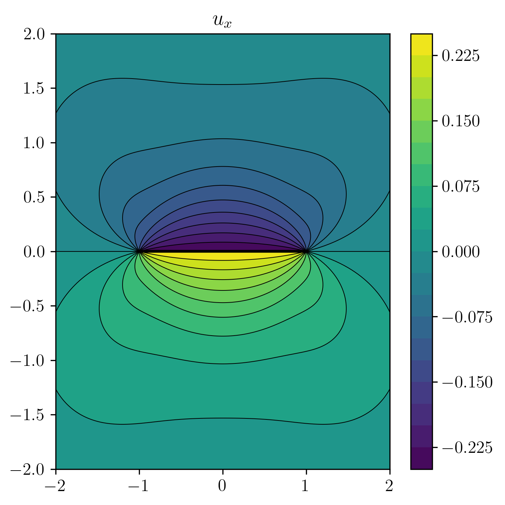

<p align=center>
    <a target="_blank" href="https://www.python.org/downloads/" title="Python version"></a>
    <a target="_blank" href="https://pypi.org/project/cutde/" title="PyPI version"></a>
    <!-- <a target="_blank" href="https://pypi.org/project/cutde/" title="PyPI"></a> -->
    <a target="_blank" href="LICENSE" title="License: MIT"></a>
    <a target="_blank" href="https://github.com/tbenthompson/cutde/actions" title="Test Status"></a>
</a>

# Python + CUDA TDEs from Nikkhoo and Walter 2015

CUDA and OpenCL-enabled fullspace triangle dislocation elements. Benchmarked at 130 million TDEs per second. Based on the [original MATLAB code from Nikhoo and Walter 2015.](https://volcanodeformation.com/software). In addition to the basic pair-wise TDE operations for displacement and strain, `cutde` also has:
* all pairs matrix construction functions.
* matrix free functions for low memory usage settings.
* block-wise functions that are especially helpful in an FMM or hierarchical matrix setting.
* a CUDA adaptive cross approximation implementation for building hierarchical matrices.

See below for basic usage and installation instructions. For more realistic usage examples, please check out [the TDE sequence in the BIE book](https://tbenthompson.com/book/tde_intro.html). You'll find examples of using all the above variants.

<!--ts-->
   * [Python + CUDA TDEs from Nikkhoo and Walter 2015](#python--cuda-tdes-from-nikkhoo-and-walter-2015)
   * [Usage documentation](#usage-documentation)
      * [Simple pair-wise TDEs](#simple-pair-wise-tdes)
      * [I want stress.](#i-want-stress)
      * [All pairs interactions matrix](#all-pairs-interactions-matrix)
      * [Matrix-free all pairs interactions](#matrix-free-all-pairs-interactions)
      * [Block-wise interaction matrices](#block-wise-interaction-matrices)
      * [Adaptive cross approximation (ACA)](#adaptive-cross-approximation-aca)
   * [Installation](#installation)
      * [PyCUDA](#pycuda)
      * [Mac OS X](#mac-os-x)
      * [Ubuntu + PyOpenCL/PoCL](#ubuntu--pyopenclpocl)
      * [Ubuntu + PyOpenCL with system drivers**](#ubuntu--pyopencl-with-system-drivers)
      * [Windows](#windows)
      * [Something else](#something-else)
      * [Why can't I use Apple CPU OpenCL?](#why-cant-i-use-apple-cpu-opencl)
   * [Development](#development)

<!-- Added by: tbent, at: Mon 14 Jun 2021 02:16:49 PM EDT -->

<!--te-->

```python

import matplotlib.pyplot as plt
import numpy as np

import cutde

xs = np.linspace(-2, 2, 200)
ys = np.linspace(-2, 2, 200)
obsx, obsy = np.meshgrid(xs, ys)
pts = np.array([obsx, obsy, 0 * obsy]).reshape((3, -1)).T.copy()

fault_pts = np.array([[-1, 0, 0], [1, 0, 0], [1, 0, -1], [-1, 0, -1]])
fault_tris = np.array([[0, 1, 2], [0, 2, 3]], dtype=np.int64)

disp_mat = cutde.disp_matrix(obs_pts=pts, tris=fault_pts[fault_tris], nu=0.25)

slip = np.array([[1, 0, 0], [1, 0, 0]])
disp = disp_mat.reshape((-1, 6)).dot(slip.flatten())

disp_grid = disp.reshape((*obsx.shape, 3))

plt.figure(figsize=(5, 5), dpi=300)
cntf = plt.contourf(obsx, obsy, disp_grid[:, :, 0], levels=21)
plt.contour(
    obsx,
    obsy,
    disp_grid[:, :, 0],
    colors="k",
    linestyles="-",
    linewidths=0.5,
    levels=21,
)
plt.colorbar(cntf)
plt.title("$u_x$")
plt.tight_layout()
plt.savefig("docs/example.png", bbox_inches="tight")

```



# Usage documentation
## Simple pair-wise TDEs

Computing TDEs for observation point/source element pairs is really simple:

```
import cutde

disp = cutde.disp(obs_pts, src_tris, slips, nu)
strain = cutde.strain(obs_pts, src_tris, slips, nu)
```

* `obs_pts` is a `np.array` with shape `(N, 3)`
* `src_tris` is a `np.array` with shape `(N, 3, 3)` where the second dimension corresponds to each vertex and the third dimension corresponds to the cooordinates of those vertices.
* slips is a `np.array` with shape `(N, 3)` where `slips[:,0]` is the strike slip component, while component 1 is the dip slip and component 2 is the tensile/opening component.
* the last parameter, nu, is the Poisson ratio. 

IMPORTANT: N should be the same for all these arrays. There is exactly one triangle and slip value used for each observation point. 

* The output `disp` is a `(N, 3)` array with displacement components in the x, y, z directions.
* The output `strain` is a `(N, 6)` array representing a symmetric tensor. `strain[:,0]` is the xx component of strain, 1 is yy, 2 is zz, 3 is xy, 4 is xz, and 5 is  yz.

## I want stress.

Use:

```
stress = cutde.strain_to_stress(strain, sm, nu)
```

to convert from stress to strain assuming isotropic linear elasticity. `sm` is the shear modulus and `nu` is the Poisson ratio.

## All pairs interactions matrix

If, instead, you want to create a matrix representing the interaction between every observation point and every source triangle, there is a different interface:

```
import cutde

disp_mat = cutde.disp_matrix(obs_pts, src_tris, nu)
strain_mat = cutde.strain_matrix(obs_pts, src_tris, nu)
```

* `obs_pts` is a `np.array` with shape `(N_OBS_PTS, 3)`
* `src_tris` is a `np.array` with shape `(N_SRC_TRIS, 3, 3)` where the second dimension corresponds to each vertex and the third dimension corresponds to the cooordinates of those vertices.
* the last parameter, nu, is the Poisson ratio. 
* The output `disp_mat` is a `(N_OBS_PTS, 3, N_SRC_TRIS, 3)` array. The second dimension corresponds to the components of the observed displacement while the fourth dimension corresponds to the component of the source slip vector. The slip vector components are ordered the same way as in `cutde.disp` and `cutde.strain`.
* The output `strain_mat` is a `(N_OBS_PTS, 6, N_SRC_TRIS, 3)` array. Like above, the dimension corresponds to the components of the observation strain with the ordering identical to `cutde.strain`.

Note that to use the `strain_to_stress` function, you'll need to re-order the axes of the `strain` array. You can do this with `np.transpose(...)`.

## Matrix-free all pairs interactions

A common use of the matrices produced above by `cutde.disp_matrix` would be to perform matrix-vector products with a input vector with `(N_SRC_TRIS * 3)` entries and an output vector with `(N_OBS_PTS * 6)` entries. But, building the entire matrix can require a very large amount of memory. In some situations, it's useful to compute matrix-vector products without ever computing the matrix itself, a so-called "matrix-free" operation. In order to do this, the matrix entries are recomputed whenever they are needed. As a result, performing a matrix-vector product is much slower -- on my machine, about 20x slower. But, the trade-off may be worthwhile if you are memory-constrained.

```
disp = cutde.disp_free(obs_pts, src_tris, slips, nu)
strain = cutde.strain_free(obs_pts, src_tris, slips, nu)
```

The parameters are the same as for `cutde.disp_matrix` with the addition of `slips`. The `slips` array is a `(N_SRC_TRIS, 3)` array containing the source slip vectors.

## Block-wise interaction matrices

In some settings, it is useful to compute many sub-blocks of a matrix without computing the full matrix. For example, this is useful for the nearfield component of a hierarchical matrix or fast multipole approximation.

```
disp_matrices, block_idxs = cutde.disp_block(
    obs_pts, src_tris, obs_start, obs_end, src_start, src_end, nu
)
strain_matrices, strain_block_idxs = cutde.strain_block(
    obs_pts, src_tris, obs_start, obs_end, src_start, src_end, nu
)
```

* `obs_pts`, `src_tris` and `nu` are the same as for `disp_matrix`.
* `obs_starts` and `obs_end` are arrays with `N_BLOCKS` elements representing the first and last observation point indices in each block.
* `src_starts` and `src_end` are arrays with `N_BLOCKS` elements representing the first and last source triangle indices in each block.

The output `disp_matrices` and `strain_matrices` will be a densely packed representation with each block's boundaries demarcated by `block_idxs`. As an example of extracting a single block:
```
disp_matrices, block_idxs = cutde.disp_block(obs_pts, src_tris, [0, 5], [5, 10], [0, 2], [2, 4], nu)
block1 = disp_matrices[block_idxs[0]:block_idxs[1]].reshape((5, 3, 2, 3))
```

## Adaptive cross approximation (ACA) 

Sometimes the matrix blocks we want to compute represent far-field interactions where the observation points are all sufficiently far away and separated as a group from the source triangles. In this situation, the matrix blocks are approximately low rank. An approximate matrix will require much less storage space and allow for more efficient matrix-vector products. Adaptive cross approximation is an algorithm for computing such a low rank representation. See [Grasedyck 2005](https://link.springer.com/content/pdf/10.1007/s00607-004-0103-1.pdf) for an accessible and general introduction to ACA. Or, see the [ACA section here](https://tbenthompson.com/book/tdes/low_rank.html) for an introduction that [builds up to using the `cutde.disp_aca` implementation](https://tbenthompson.com/book/tdes/hmatrix.html).

```
disp_appxs = cutde.disp_aca(
    obs_pts, tris, obs_start, obs_end, src_start, src_end, nu, tol, max_iter
)
```

The parameters are the same as `cutde.disp_block` with the addition of `tol` and `max_iter`. The tolerance, `tol`, is specified as an array of length `N_BLOCKS` in terms of the Frobenius norm of the error matrix between the true matrix and the approximation. The algorithm is not guaranteed to reach the specified tolerance but should come very close. The maximum number of iterations (equal to the maximum rank of the approximation) is also specified as an array of length `N_BLOCKS`.

The output `disp_appxs` will be a list of `(U, V)` pairs representing the left and right vectors of the low rank approximation. To approximate a matrix vector product:
```
U, V = disp_appxs[0]
y = U.dot(V.dot(x))
```

# Installation

To install `cutde` itself run:
```
pip install cutde
```

Then, install either PyCUDA or PyOpenCL following the directions below.

## PyCUDA
If you have an NVIDIA GPU, install PyCUDA with:
```
conda config --prepend channels conda-forge
conda install -c conda-forge pycuda
```

## Mac OS X
Install PyOpenCL and the PoCL OpenCL driver with:
```
conda config --prepend channels conda-forge
conda install pocl pyopencl
```

## Ubuntu + PyOpenCL/PoCL

Just like on a Mac:
```
conda config --prepend channels conda-forge
conda install pocl pyopencl
```


## Ubuntu + PyOpenCL with system drivers** 
```
conda install pyopencl ocl-icd ocl-icd-system
```
You will need to install the system OpenCL drivers yourself depending on the hardware you have. See the "Something else" section below.

## Windows

I'm not aware of anyone testing cutde on Windows yet. It should not be difficult to install. I would expect that you install pyopencl via conda and then install the OpenCL libraries and drivers that are provided by your hardware vendor. See the "Something else" section below.

## Something else
I'd suggest starting by trying the instructions for the system most similar to yours above. If that doesn't work, never fear! OpenCL should be installable on almost all recent hardware and typical operating systems. [These directions can be helpful.](https://documen.tician.de/pyopencl/misc.html#installing-from-conda-forge). I am happy to try to help if you have OpenCL installation issues, but I can't promise to be useful.

## Why can't I use Apple CPU OpenCL?

You might have gotten the message: `cutde does not support the Apple CPU OpenCL implementation and no other platform or device was found. Please consult the cutde README.`

The Apple OpenCL implementation for Intel CPUs has very poor support for the OpenCL standard and causes lots of difficult-to-resolve errors. Instead, please use [the PoCL implementation](http://portablecl.org/). You can install it with `conda install -c conda-forge pocl`.

# Development

For developing `cutde`, clone the repo and set up your conda environment based on the `environment.yml` with:

```
conda env create
```

Next, install either `pycuda` or `pyopencl` as instructed in the Installation section above.

Then, you should re-generate the baseline test data derived from [the MATLAB code from Mehdi Nikhoo](https://volcanodeformation.com/software). To do this, first install `octave`. On Ubuntu, this is just:

```
sudo apt-get install octave
```

And run 

```
./tests/setup_test_env
```

which will run the `tests/matlab/gen_test_data.m` script.

Finally, to check that `cutde` is working properly, run `pytest`!

The library is extremely simple:
* `cutde.fullspace` - the main entrypoint.
* `fullspace.cu` - a direct translation of the original MATLAB into CUDA/OpenCL. This probably should not be modified.
* `cutde.gpu` - a layer that abstracts between CUDA and OpenCL
* `cutde.cuda` - the PyCUDA interface.
* `cutde.opencl` - the PyOpenCL interface.

The `tests/tde_profile.py` script is useful for assessing performance. 

Some tests are marked as slow. To run these, run `pytest --runslow`. 

If you have both CUDA and OpenCL installed, `cutde` will default to using CUDA. To use OpenCL instead, run `export CUTDE_USE_OPENCL=1` to set the environment flag before launching the Python session that will use `cutde`.

The `README.md` is auto-generated from a template in `docs/`. To run this process, run `docs/build_docs`.
